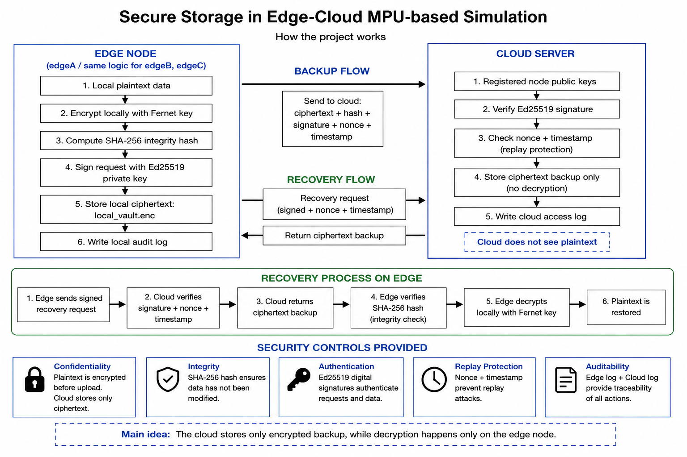

# Secure Storage in an Edge-Cloud Simulation

## Project Overview

This project is a Python/FastAPI simulation of a secure edge-cloud storage system. It models edge nodes that encrypt data locally and a cloud service that stores only encrypted backups.

The implementation is designed for demonstration and academic evaluation. It shows how confidentiality, integrity, authentication, replay protection, and auditability can be combined in a small distributed storage prototype.

## Main Security Idea

The edge node is the only component that handles plaintext. Before any data is sent to the cloud, the edge node encrypts it locally. The cloud stores ciphertext and metadata, but it never receives or decrypts plaintext.

Each cloud request is signed by the edge node with an Ed25519 private key. The cloud verifies the registered public key, checks timestamp freshness, and rejects replayed nonces. Stored ciphertext is protected with a SHA-256 integrity hash and verified again during recovery.

## Technologies Used

- Python 3
- FastAPI
- Uvicorn
- Pydantic
- Cryptography
  - Fernet symmetric encryption
  - Ed25519 digital signatures
- SHA-256 integrity checks
- File-backed JSON state for the local simulation
- Windows batch launcher for the demo environment

## Architecture Diagram



## Project Structure

```text
SS_project/
|-- app/
|   |-- audit.py
|   |-- cloud_service.py
|   |-- config.py
|   |-- crypto_utils.py
|   |-- edge_service.py
|   |-- integrity.py
|   |-- models.py
|   `-- storage.py
|-- docs/
|   `-- images/
|       `-- ss_schema.png
|-- demo_client.py
|-- run_demo.bat
|-- setup.py
|-- README.md
`-- .gitignore
```

Runtime data is generated under `data/` after setup. The virtual environment, runtime state, cache files, and lock files are intentionally excluded from version control.

## How to Run

Create and activate a Python virtual environment, then install the project dependencies used by the application:

```powershell
python -m venv .venv
.\.venv\Scripts\activate
pip install fastapi uvicorn cryptography pydantic
```

Initialize keys, state folders, nonce caches, and audit logs:

```powershell
python setup.py
```

### One-Click Launcher

On Windows, start both services with:

```powershell
.\run_demo.bat
```

The launcher:

- starts the cloud service on `http://127.0.0.1:8200`
- starts edge node `edgeA` on `http://127.0.0.1:8101`
- waits until both `/health` endpoints respond
- opens only the browser demo page

The cloud Swagger documentation is still available manually at:

```text
http://127.0.0.1:8200/docs
```

## Browser Demo Page

After running `run_demo.bat`, open:

```text
http://127.0.0.1:8101/demo-page
```

The browser page provides a readable dashboard for:

- edge and cloud health
- edge identity
- local vault metadata
- encryption and cloud backup
- cloud recovery and local decryption
- edge audit log
- cloud access log

Raw JSON remains available in collapsible sections for debugging, but the primary view is human-readable.

## Command-Line Demo Client

The command-line demo runs the complete edge-cloud flow:

```powershell
python demo_client.py
```

It calls:

1. edge health check
2. local encrypt and cloud backup
3. cloud recovery and local decrypt
4. local storage view
5. edge audit log

## Available Endpoints

### Edge Service (`http://127.0.0.1:8101`)

| Method | Endpoint | Purpose |
| --- | --- | --- |
| `GET` | `/health` | Edge service health |
| `GET` | `/identity` | Edge node ID and public key |
| `GET` | `/demo-page` | Browser dashboard |
| `POST` | `/encrypt-and-backup` | Encrypt plaintext locally and store ciphertext in cloud |
| `POST` | `/recover-from-cloud` | Retrieve ciphertext, verify integrity, and decrypt locally |
| `GET` | `/local-storage` | Local vault metadata |
| `GET` | `/audit-log` | Edge audit log |

### Cloud Service (`http://127.0.0.1:8200`)

| Method | Endpoint | Purpose |
| --- | --- | --- |
| `GET` | `/health` | Cloud service health |
| `POST` | `/register-node` | Register an edge public key |
| `POST` | `/store-backup` | Store signed ciphertext backup |
| `POST` | `/retrieve-backup` | Retrieve signed ciphertext backup |
| `GET` | `/access-log` | Cloud access log |
| `GET` | `/docs` | FastAPI Swagger documentation |

## Attack Demonstrations

### Replay Protection

Cloud requests include a timestamp and nonce. If the same signed request is sent twice within the replay window, the first request may succeed, but the repeated request is rejected:

```text
409 Replay detected
```

This demonstrates that captured signed requests cannot be reused directly.

### Tampered Ciphertext / Integrity Failure

The cloud stores ciphertext and an integrity hash. During recovery, the edge recomputes the SHA-256 hash of the returned ciphertext. If the ciphertext has been modified, recovery fails:

```text
409 Integrity verification failed
```

This demonstrates that modified backups are detected before decryption.

## Limitations

- This is a local simulation, not a production deployment.
- Runtime state is stored in local JSON files.
- Private keys are stored unencrypted on disk for demo simplicity.
- There is no user authentication layer around the browser dashboard.
- The system uses local HTTP services, not TLS.
- Only the `edgeA` node is launched by `run_demo.bat`; `edgeB` and `edgeC` are initialized for extension.

## Submission Notes

Before committing, avoid adding generated files such as:

- `.venv/`
- `data/`
- `__pycache__/`
- `*.pyc`
- `*.lock`

The repository should contain source code, documentation, the demo launcher, the demo client, and the architecture image.
